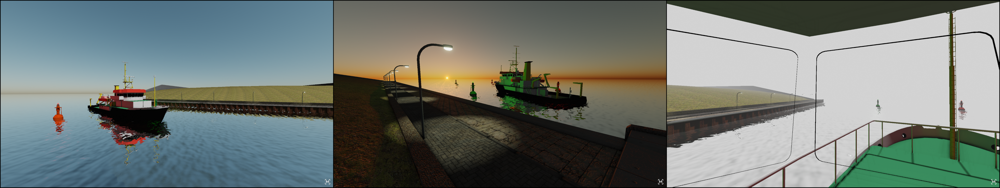

# PRISMA
PRISMA is a graphical visualization tool to render 2D or 3D scenes, controlled via a network interface based on UDP multicast.
Send messages to PRISMA to render your own scene of custom meshes, various light casters, atmosphere, fog and water.
The internal rendering pipeline contains shadow mapping, ambient occlusion and bloom, whose parameters can be adjusted at runtime.
This repository is structured as follows.

| File / Directory   | Description                                                                                                                              |
| :----------------- | :--------------------------------------------------------------------------------------------------------------------------------------- |
| release            | contains the release application and all files required at runtime                                                                       |
| matlab             | contains a MATLAB/simulink project with a simulink library (>= R2024a) that can be used to pack and unpack messages to be sent to PRISMA |
| source             | contains the whole source code of PRISMA as well as third party code                                                                     |
| workspace          | contains additional sources such as logo, images, etc.                                                                                   |
| LICENSE            | license information                                                                                                                      |
| Makefile           | Makefile used to build PRISMA                                                                                                            |
| README.md          | this file                                                                                                                                |





## Overview
PRISMA is structured as a state machine and always retains the last value received.
The state contains, for example, the pose of the camera and numerous parameters of the graphics engine.
There is also a database in which all objects, such as meshes and various light casters, are stored.
The state of PRISMA can be changed using corresponding UDP messages and new objects can be added to or removed from the database.
Each time the application is started, the default state is loaded and all databases are empty.
The state is not saved when PRISMA is closed.
When sending a clear message to PRISMA, the whole state is reset to its default values.

- [Getting Started](#getting-started)
    - [Adjust the Configuration](#adjust-the-configuration)
    - [Send Messages or Run Examples](#send-messages-or-run-examples)
    - [Controls](#controls)
- [How To Build](#how-to-build)
- [PRISMA Configuration File](#prisma-configuration-file)
- [Supported Mesh Types](#supported-mesh-types)
    - [Polygon File Format](#polygon-file-format)
    - [Wavefront OBJ](#wavefront-obj)
- [UDP Message Protocol](#udp-message-protocol)
- [Error Handling](#error-handling)


## Getting Started
PRISMA currently runs under Windows and Linux operating systems and requires a GPU that supports the OpenGL core profile.
Click [here](#how-to-build) for more information on building the application.
The finished software and all files required to run it are located in the `release` directory, which is structured as follows

| File / Directory     | Description                                                                                                                                            |
| :------------------- | :----------------------------------------------------------------------------------------------------------------------------------------------------- |
| `assets/mesh`        | Contains all meshes that can be loaded by PRISMA. Put your custom meshes in here (subdirectories are possible). PRISMA comes with some example meshes. |
| `assets/shader`      | Contains all shader files that are required for rendering.                                                                                             |
| `assets/texture`     | Contains textures for PRISMA internal things.                                                                                                          |
| `assets/PRISMA.json` | The configuration file loaded by the application at startup if no other configuration file is specified.                                               |
| `protocol`           | Automatically generated directory that stores protocol files.                                                                                          |
| `PRISMA`             | The executable.                                                                                                                                        |

Copy all your own meshes and the corresponding textures into the `assets/mesh` directory.
PRISMA searches this directory when prompted to add a new mesh to the scene.
For supported mesh types see [here](#supported-mesh-types).
To start, run the application `PRISMA`.
A window with the logo appears, which disappears after a few seconds.
PRISMA starts in its default state, with only a dark gray background.

### Adjust the Configuration
With the use of a [configuration file](#prisma-configuration-file), additional window settings, such as full screen mode, can be made.
This file is also used to define the network interface for PRISMA.
The entries in the configuration file are read out when the application is started.
If the file contains errors, the application terminates and reports an error in the protocol file (see [error handling](#error-handling)).
By default, PRISMA joins the multicast group `239.192.42.252` and listens at port `31416`.

### Send Messages or Run Examples
Next, send UDP messages to PRISMA to create your scene.
A list of available messages can be found [here](#udp-message-protocol).
Users who work with MATLAB/Simulink can run the simulink examples, which can be found under [matlab/examples](matlab/examples/).
They require the [GenericTarget](https://github.com/RobertDamerius/GenericTarget) toolbox for sending UDP messages.

### Controls
By default, the camera is controlled via the [camera message](#camera-message).
However, the camera can also be operated manually using the mouse and keyboard.
Press `F1` to toggle manual camera control.
If PRISMA is in manual camera control mode, an `M` appears in the bottom-right corner.
All available controls are listed in the tables below.

**Keyboard Settings**<br>

| Key      | Description                                                                                                                   |
| :------- | :---------------------------------------------------------------------------------------------------------------------------- |
| `F1`     | Toggle the manual camera control mode.                                                                                        |
| `ESC`    | Close PRISMA if the option `window.closeWithEscape` is set to `True` in the [configuration file](#prisma-configuration-file). |
| `W`      | Move camera forward if manual camera control is enabled.                                                                      |
| `A`      | Move camera to the left if manual camera control is enabled.                                                                  |
| `S`      | Move camera back if manual camera control is enabled.                                                                         |
| `D`      | Move camera to the right if manual camera control is enabled.                                                                 |
| `SPACE`  | Move camera up if manual camera control is enabled.                                                                           |
| `LSHIFT` | Move camera down if manual camera control is enabled.                                                                         |

**Mouse Settings**<br>

If the manual camera control mode is enabled, then left click into the scene and move the cursor to rotate the camera.


## How To Build
> **Windows**<br>
> On Windows you can build the software yourself using [MSYS2/MinGW64](https://www.msys2.org).

> **Linux**<br>
> On Linux you can build the software yourself.

You need the GNU make tool and a GNU compiler that supports the C++20 standard.
If your header files for required libraries are in a different location than mine, you can change this in `source/Common.hpp`.
If the corresponding libraries to be linked against are named differently, you can change this in the `Makefile` on line 44 (Windows) or 45 (Linux).


### External libraries required
Some third-party source code files are already present in the `source/thirdparty` directory. These include
[json](https://github.com/nlohmann/json), [LodePNG](https://github.com/lvandeve/lodepng) and [Earcut](https://github.com/mapbox/earcut).
All other required external libraries are shown in the following table.

| Library                                      | Windows (MSYS2/MinGW64)              | Linux (Ubuntu)                       | Comment                                          |
| :------------------------------------------- | :----------------------------------- | :----------------------------------- | :----------------------------------------------- |
| OpenGL                                       | already comes with MSYS2/MinGW64     | `sudo apt install libgl1-mesa-dev`   | OpenGL                                           |
| [GLFW3](https://github.com/glfw/glfw)        | `pacman -S mingw-w64-x86_64-glfw`    | `sudo apt install libglfw3-dev`      | used to create window and OpenGL-context         |
| [GLEW](http://glew.sourceforge.net)          | `pacman -S mingw-w64-x86_64-glew`    | `sudo apt install libglew-dev`       | OpenGL extension wrangler library                |
| [GLM](https://github.com/g-truc/glm)         | `pacman -S mingw-w64-x86_64-glm`     | `sudo apt install libglm-dev`        | OpenGL mathematics                               |


### Build procedure
The Makefile is designed to work with the default GNU compiler (GCC) under Linux and the MinGW toolchain under Windows.


**Prepare**<br>
You can use the following command to clean up before a rebuilding:
```
make clean
```

**Compile and link**<br>
Use the command
```
make
```
to compile all sources and link them together to the final software product.
The final product is written to the `release` directory.
If you have made changes to some code files and recompiled them with `make`, only the sources affected by these changes will be recompiled.
Be careful when renaming sources or moving them to other directories, because then the build directory is no longer consistent with the source directory, which can lead to errors.
In this case a complete rebuilding is recommended.


### Build with DEBUG mode enabled
To build PRISMA with debug mode enabled, modify line 15 of the `Makefile` to `DEBUG_MODE := 1` and then perform a complete rebuild:
```
make clean && make
```


## PRISMA Configuration File
The PRISMA configuration file is located under `release/assets/PRISMA.json`.
This file is loaded when the application is started.
It contains window settings, network configuration and so on.
A list of keys that must be set is shown in the following table.

| Key                                  | Default Value       | Description                                                                                                                            |
| :----------------------------------- | :------------------ | :------------------------------------------------------------------------------------------------------------------------------------- |
| `window.width`                       | 1920                | Width of the window in pixels.                                                                                                         |
| `window.height`                      | 1080                | Height of the window in pixels.                                                                                                        |
| `window.fullscreen`                  | false               | True if fullscreen should be enabled, false otherwise.                                                                                 |
| `window.fullscreenMonitorIndex`      | 0                   | The index of the monitor to be used in fullscreen mode.                                                                                |
| `window.resizable`                   | true                | True if window should be resizable, false otherwise.                                                                                   |
| `window.visible`                     | true                | True if the window should be visible, false otherwise.                                                                                 |
| `window.decorated`                   | true                | True if the window should be decorated, false otherwise.                                                                               |
| `window.focused`                     | true                | True if the window should be focused, false otherwise.                                                                                 |
| `window.maximized`                   | false               | True if the window should be maximized, false otherwise.                                                                               |
| `window.glMajorVersion`              | 4                   | The Open-GL major version to be set for the window context.                                                                            |
| `window.glMinorVersion`              | 5                   | The Open-GL minor version to be set for the window context.                                                                            |
| `window.title`                       | "PRISMA"            | The window title to be set.                                                                                                            |
| `window.showFPSInTitle`              | true                | True if FPS should be shown in title.                                                                                                  |
| `window.closeWithEscape`             | true                | True if the window should be closed with the escape key of the keyboard.                                                               |
| `engine.enableWaterReflection`       | true                | True if water reflection should be enabled, false otherwise.                                                                           |
| `engine.enableAtmosphericScattering` | true                | True if atmospheric scattering should be enabled, false otherwise.                                                                     |
| `engine.enableShadowMapping`         | true                | True if shadow mapping should be enabled, false otherwise.                                                                             |
| `engine.enableAmbientOcclusion`      | true                | True if ambient occlusion should be enabled, false otherwise.                                                                          |
| `engine.enableBloom`                 | true                | True if bloom should be enabled, false otherwise.                                                                                      |
| `engine.maxNumDirectionalLights`     | 8                   | Maximum number of directional lights.                                                                                                  |
| `engine.maxNumPointLights`           | 256                 | Maximum number of point lights.                                                                                                        |
| `engine.maxNumSpotLights`            | 256                 | Maximum number of spot lights.                                                                                                         |
| `engine.ssaoKernelSize`              | 16                  | The kernel size for SSAO.                                                                                                              |
| `engine.shadowFrustumSplitLevels`    | [0.04, 0.1, 0.5]    | Normalized frustum split levels for cascaded shadow mapping.                                                                           |
| `engine.shadowMapResolution`         | 4096                | Resolution of the shadow map in pixels.                                                                                                |
| `engine.maxNumBloomMips`             | 6                   | The maximum number of bloom mips.                                                                                                      |
| `network.localPort`                  | 31416               | The local port to be bound.                                                                                                            |
| `network.interfaceAddress`           | [0,0,0,0]           | IPv4 address of the network interface to be used for joining the multicast group.                                                      |
| `network.interfaceName`              | ""                  | Name of the network interface to be used for joining the multicast group. If this string is empty, `network.interfaceAddress` is used. |
| `network.socketPriority`             | 0                   | The socket priority (linux only, in range [0 (lowest), 6 (greatest)]).                                                                 |
| `network.socketErrorRetryTimeMs`     | 1000                | Time in milliseconds to wait in case of an socket error before trying again.                                                           |
| `network.receive.multicastGroups`    | [[239,192,42,252]]  | The group addresses to be joined.                                                                                                      |
| `network.send.destinationAddresses`  | [[127,0,0,1,12701]] | The destination addresses {ipA, ipB, ipC, ipD, port} to which to send messages.                                                        |
| `network.send.timeToLive`            | 1                   | The time-to-live (TTL) value to be set for multicast messages.                                                                         |

Alternatively, a custom configuration file can be passed as an argument when starting the application.
If you, for example, have multiple configuration files, then you can launch PRISMA with a specified configuration via
```
PRISMA path/to/configuration.json
```

## Supported Mesh Types
All meshes that are read into PRISMA must consist exclusively of triangles.
The following mesh file formats are supported:
- `.ply`: Polygon File Format (ASCII format only)
- `.obj`+`.mtl`: Wavefront OBJ


### Polygon File Format
The ply format is suitable for saving colored meshes in which each vertex has an RGB color attribute in addition to the position and the normal vector.
Only the ASCII format of ply is supported in PRISMA.
The following properties are evaluated:

| Property               | Description                                                                            |
| :--------------------- | :--------------------------------------------------------------------------------------|
| `x`, `y`, `z`          | x-, y- and z-position of a vertex. The datatype must be `float`.                       |
| `nx`, `ny`, `nz`       | x-, y- and z-component of the normal vector of a vertex. The datatype must be `float`. |
| `red`, `green`, `blue` | RGB color attribute a vertex. The datatype must be `uchar`.                            |

If one of these properties is not given, it's value is set to zero.


### Wavefront OBJ
This format can be used to save textured meshes.
In addition to position and the normal vector, each vertex contains a texture coordinate.
Furthermore, the name of a material file (`.mtl`) is specified in an OBJ file.
PRISMA searches for this MTL file relative to the OBJ file.
The material file contains information on diffuse, specular and emission color and also specifies texture maps.
All texture maps must be given in the PNG image format.
PRISMA searches for the specified images relative to the material file.
The following entries in the material file are used.
If an entry is not specified, then the default value is applied.

| Property        | Default Value          | Description                              |
| :-------------- | :--------------------- | :----------------------------------------|
| `Ns`            | `0`                    | Scalar value representing the shininess. |
| `Kd`            | `{0, 0, 0}`            | Diffuse color.                           |
| `Ke`            | `{0, 0, 0}`            | Emission color.                          |
| `Ks`            | `{0, 0, 0}`            | Specular color.                          |
| `map_Kd`        | `{255, 255, 255, 255}` | Texture for the diffuse map.             |
| `map_Ke`        | `{255, 255, 255}`      | Texture for the emission map.            |
| `map_Ks`        | `{255, 255, 255}`      | Texture for the specular map.            |
| `norm`,`map_Kn` | `{128, 128, 255}`      | Texture for the normal map.              |

During rendering, a texture map is multiplied by the corresponding color value to obtain the resulting fragment color, e.g. `Kd * vec3(map_Kd)`.

**Alpha Testing**<br>
If the diffuse map texture contains a pixel with an alpha channel smaller than `0xFF`, the texture is considered transparent and the corresponding mesh is rendered without face culling (GL_CULL_FACE is disabled).
As a result, faces are visible from both sides.
An alpha test is carried out in the fragment shader based on the alpha channel.
A corresponding pixel of the diffuse map is drawn if the alpha value is greater than or equal to 50 percent.
Otherwise it is not drawn.


## UDP Message Protocol
By sending different types of messages to PRISMA the internal state of PRISMA can be updated and objects can be added to or removed from the scene.
Several messages can be packed one after the other in a single UDP datagram so that several states can be adjusted with a single transmission.
Keep in mind that the maximum data length for UDP is limited to 65507 bytes.
The messages are processed by PRISMA in the order in which they are received.
If an incorrect or invalid message is sent, PRISMA responds and sends a UDP message with human-readable text back to the sender.
The whole datagram is discarded in this case.

For all messages, the **network byte-order** is used which is defined to be big-endian.
There are two types of messages: Incomming and outgoing messages.
Each incomming message to PRISMA begins with an ID byte that specifies the type of message.
The following table gives an overview of available input messages and their corresponding ID.

| ID          | Name                                            | Description                                                                                  |
| :---------- | :---------------------------------------------- | :------------------------------------------------------------------------------------------- |
| 0x00        | [Clear](#clear-message)                         | Clear the state of PRISMA and set default values. All meshes are removed.                    |
| 0x01        | [Engine Parameter](#engine-parameter-message)   | Change parameters of the internal rendering engine.                                          |
| 0x02        | [Camera](#camera-message)                       | Set the view camera state, e.g. position, orientation, clipping planes.                      |
| 0x03        | [Atmosphere](#atmosphere-message)               | Set parameters for atmosphere and fog.                                                       |
| 0x04        | [Ambient Light](#ambient-light-message)         | Set ambient light color.                                                                     |
| 0x05        | [Directional Light](#directional-light-message) | Add, remove or change directional lights.                                                    |
| 0x06        | [Point Light](#point-light-message)             | Add, remove or change point lights.                                                          |
| 0x07        | [Spot Light](#spot-light-message)               | Add, remove or change spot lights.                                                           |
| 0x08        | [Mesh](#mesh-message)                           | Add, remove or change meshes, either textured objects (.obj/.mtl) or colored objects (.ply). |
| 0x09        | [Water Mesh](#water-mesh-message)               | Set the water mesh and its parameters.                                                       |
| 0x0A        | [Dynamic Mesh](#dynamic-mesh-message)           | Add, remove or change dynamic meshes (variable-length list of triangles).                    |

There is one output message PRISMA sends to all destination addresses defined via the [configuration file](#prisma-configuration-file).
Before rendering a frame, PRISMA polls the window events and sends a window event message that contains raw mouse and keyboard events from GLFW.

| Name                                  | Description                                                      |
| :------------------------------------ | :--------------------------------------------------------------- |
| [Window Event](#window-event-message) | Contains window events such as cursor position and pressed keys. |


### Clear Message
A clear message resets the internal state of PRISMA to default values.
| Datatype | Name          | Description                                                |
| :------- | :------------ | :--------------------------------------------------------- |
| `uint8`  | `messageType` | Header indicating the type of the message. Must be `0x00`. |


### Engine Parameter Message
This message sets tuning parameters for the pipeline of the graphics engine.

| Datatype | Name                        | Description                                                       |
| :------- | :-------------------------- | :---------------------------------------------------------------- |
| `uint8`  | `messageType`               | Header indicating the type of the message. Must be `0x01`.        |
| `float`  | `ambientOcclusionRadius`    | Radius for the ambient occlusion.                                 |
| `float`  | `ambientOcclusionBias`      | Bias for ambient occlusion.                                       |
| `float`  | `ambientOcclusionEnhance`   | Enhancement of the ambient occlusion strength.                    |
| `float`  | `removeShadowOnWater`       | Amount for removing shadow on water.                              |
| `float`  | `bloomBrightnessThreshold`  | Brightness threshold for bloom effects.                           |
| `float`  | `bloomStrength`             | Bloom strength during post-processing.                            |
| `float`  | `gamma`                     | Gamma value of the monitor.                                       |
| `float`  | `ditheringNoiseGranularity` | Noise granularity for the dithering noise during post-processing. |
| `float`  | `shadowBiasMin`             | Minimum value for shadow bias.                                    |
| `float`  | `shadowBiasMax`             | Maximum value for shadow bias.                                    |
| `float`  | `exposure`                  | Exposure value during post-processing.                            |
| `float`  | `toneMappingStrength`       | Tone mapping strength during post-processing.                     |


### Camera Message
The camera message sets position and orientation as well as parameters such as clipping planes and field of view of the camera.

| Datatype    | Name                     | Description                                                                                          |
| :---------- | :----------------------- | :--------------------------------------------------------------------------------------------------- |
| `uint8`     | `messageType`            | Header indicating the type of the message. Must be `0x02`.                                           |
| `uint8`     | `mode`                   | The camera mode. Must be either `0x00` for perspective or `0x01` for orthographic camera projection. |
| `float [3]` | `position`               | The position in world space coordinates.                                                             |
| `float [4]` | `quaternion`             | The unit quaternion representing the orientation of the camera (stored as x,y,z,w).                  |
| `float`     | `clipNear`               | The near clipping plane.                                                                             |
| `float`     | `clipFar`                | The far clipping plane.                                                                              |
| `float`     | `orthographicLeft`       | The left border limit for orthographic projection.                                                   |
| `float`     | `orthographicRight`      | The right border limit for orthographic projection.                                                  |
| `float`     | `orthographicBottom`     | The bottom border limit for orthographic projection.                                                 |
| `float`     | `orthographicTop`        | The top border limit for orthographic projection.                                                    |
| `float`     | `perspectiveFieldOfView` | The field of view angle in radians for perspective projection.                                       |


### Atmosphere Message
This message sets atmospheric parameters for PRISMA.

| Datatype    | Name                         | Description                                                                                                                                         |
| :---------- | :--------------------------- | :-------------------------------------------------------------------------------------------------------------------------------------------------- |
| `uint8`     | `messageType`                | Header indicating the type of the message. Must be `0x03`.                                                                                          |
| `float [3]` | `sunLightDirection`          | Sun light direction (normalized) in world-space starting from the sun.                                                                              |
| `float [4]` | `skyColorMix`                | Color to be mixed with the atmospheric scattering based sky color.                                                                                  |
| `float [4]` | `sunColorMix`                | Color to be mixed with the atmospheric scattering based sun color.                                                                                  |
| `uint8:1`   | `useMieForSunColor`          | bit0: True if Mie scattering should be used for sun color calculation.                                                                              |
| `uint8:7`   | `unused`                     | bit1-bit7: reserved, set to zero.                                                                                                                   |
| `float`     | `sunLightStrength`           | Multiplier for the directional sun light.                                                                                                           |
| `float [3]` | `eyePosition`                | World-space position relative to the center of the planet from where to start the ray-tracing for atmospheric scattering, e.g. vec3(0, 6372000, 0). |
| `float`     | `sunAtmosphereIntensity`     | Intensity of the sun for atmospheric scattering, e.g. 20.                                                                                           |
| `float`     | `radiusPlanet`               | Radius of the planet in meters, e.g. 6371000.                                                                                                       |
| `float`     | `radiusAtmosphere`           | Radius of the atmosphere in meters, e.g. 6471000.                                                                                                   |
| `float [3]` | `coefficientRayleigh`        | Precomputed Rayleigh scattering coefficients for red, green and blue wavelengths in 1/m, e.g. vec3(5.5e-6, 13.0e-6, 22.4e-6).                       |
| `float`     | `coefficientMie`             | Precomputed Mie scattering coefficient in 1/m, e.g. 21e-6.                                                                                          |
| `float`     | `scaleHeightRayleigh`        | Scale height for Rayleigh scattering in meters, e.g. 8000.                                                                                          |
| `float`     | `scaleHeightMie`             | Scale height for Mie scattering in meters, e.g. 1200.                                                                                               |
| `float`     | `scatterAmountMie`           | Amount of Mie scattering, usually in range (-1,0,1), e.g. 0.758.                                                                                    |
| `float`     | `atmosphereExposure`         | Atmosphere exposure value, e.g. 1.                                                                                                                  |
| `uint8 [2]` | `numRayTracingSteps`         | Number of ray tracing steps for primary and secondary ray tracing for the atmospheric scattering calculation, e.g. uvec2(16, 8).                    |
| `float`     | `sunDiscIntensity`           | Intensity of the sun disk, e.g. 42.                                                                                                                 |
| `float`     | `cosSunDiscInnerCutOff`      | cos(a1) where a1 is the inner angle where the smooth cut-off of the sun disc begins, e.g. 0.999995670984418.                                        |
| `float`     | `cosSunDiscOuterCutOff`      | cos(a2) where a2 is the outer angle where the smooth cut-off of the sun disc ends, e.g. 0.999989165999595.                                          |
| `float`     | `fogDepthBegin`              | Depth, where the fog begins.                                                                                                                        |
| `float`     | `fogDepthEnd`                | Depth, where the fog ends.                                                                                                                          |
| `float`     | `fogDensityBegin`            | Density of the fog at the beginning.                                                                                                                |
| `float`     | `fogDensityEnd`              | Density of the fog at the end.                                                                                                                      |
| `float [3]` | `depthFogColor`              | Color of the depth fog.                                                                                                                             |
| `float`     | `depthBlendOutDistanceMin`   | Minimum distance of the scene blend out, e.g. the depth where the scene blend out begins.                                                           |
| `float`     | `depthBlendOutDistanceRange` | Range of the scene blend out distance.                                                                                                              |


### Ambient Light Message
This message sets the ambient light state for PRISMA.

| Datatype     | Name          | Description                                                |
| :----------- | :------------ | :--------------------------------------------------------- |
| `uint8`      | `messageType` | Header indicating the type of the message. Must be `0x04`. |
| `float [3] ` | `color`       | Color of the ambient light.                                |


### Directional Light Message
This message adds, removes or modifies a directional light for PRISMA.

| Datatype    | Name                 | Description                                                             |
| :---------- | :------------------- | :---------------------------------------------------------------------- |
| `uint8`     | `messageType`        | Header indicating the type of the message. Must be `0x05`.              |
| `uint32`    | `directionalLightID` | A directional light identifier.                                         |
| `uint8:1`   | `shouldBeDeleted`    | bit0: True if the directional light should be deleted.                  |
| `uint8:1`   | `visible`            | bit1: True if the directional light should be visible, false otherwise. |
| `uint8:6`   | `unused`             | bit2-bit7: reserved, set to zero.                                       |
| `float [3]` | `color`              | Color of the directional light.                                         |
| `float [3]` | `direction`          | Normalized direction vector of the directional light.                   |


### Point Light Message
This message adds, removes or modifies a point light for PRISMA.

| Datatype    | Name               | Description                                                                              |
| :---------- | :----------------- | :--------------------------------------------------------------------------------------- |
| `uint8`     | `messageType`      | Header indicating the type of the message. Must be `0x06`.                               |
| `uint32`    | `pointLightID`     | A unique point light identifier.                                                         |
| `uint8:1`   | `shouldBeDeleted`  | bit0: True if the point light with the `pointLightID` should be deleted.                 |
| `uint8:1`   | `visible`          | bit1: True if the point light should be visible, false otherwise.                        |
| `uint8:6`   | `unused`           | bit2-bit7: reserved, set to zero.                                                        |
| `float [3]` | `color`            | The color of the point light.                                                            |
| `float [3]` | `position`         | The world-space position of the point light.                                             |
| `float`     | `quadraticFalloff` | Coefficient for light attenuation according to 1 / (1 + c*x^2).                          |
| `float`     | `invRadiusPow4`    | Inverse of radius to the power of 4, where the radius represents the range of the light. |


### Spot Light Message
This message adds, removes or modifies a spot light for PRISMA.

| Datatype    | Name                  | Description                                                                              |
| :---------- | :-------------------- | :--------------------------------------------------------------------------------------- |
| `uint8`     | `messageType`         | Header indicating the type of the message. Must be `0x07`.                               |
| `uint32`    | `spotLightID`         | A spot light identifier.                                                                 |
| `uint8:1`   | `shouldBeDeleted`     | bit0: True if the spot light with the `spotLightID` should be deleted.                   |
| `uint8:1`   | `visible`             | bit1: True if the spot light should be visible, false otherwise.                         |
| `uint8:6`   | `unused`              | bit2-bit7: reserved, set to zero.                                                        |
| `float [3]` | `color`               | Color of the spot light.                                                                 |
| `float [3]` | `position`            | World-space position of the spot light.                                                  |
| `float [3]` | `direction`           | Normalized direction vector of the spot light.                                           |
| `float`     | `quadraticFalloff`    | Coefficient for light attenuation according to 1 / (1 + c*x^2).                          |
| `float`     | `invRadiusPow4`       | Inverse of radius to the power of 4, where the radius represents the range of the light. |
| `float`     | `cosInnerCutOffAngle` | Cosine of the inner cut-off angle of light cone.                                         |
| `float`     | `cosOuterCutOffAngle` | Cosine of the outer cut-off angle of light cone.                                         |


### Mesh Message
This message adds, removes or modifies mesh objects for PRISMA.

| Datatype    | Name                      | Description                                                               |
| :---------- | :------------------------ | :------------------------------------------------------------------------ |
| `uint8`     | `messageType`             | Header indicating the type of the message. Must be `0x08`.                |
| `uint32`    | `meshID`                  | A unique mesh identifier.                                                 |
| `uint8:1`   | `shouldBeDeleted`         | bit0: True if the mesh with the `meshID` should be deleted.               |
| `uint8:1`   | `visible`                 | bit1: True if this mesh object is visible, false otherwise.               |
| `uint8:1`   | `castShadow`              | bit2: True if this mesh casts a shadow, false otherwise.                  |
| `uint8:5`   | `unused`                  | bit3-bit7: reserved, set to zero.                                         |
| `float [3]` | `position`                | Position in OpenGL world space coordinates.                               |
| `float [4]` | `quaternion`              | Unit quaternion that represents the orientation of this mesh.             |
| `float [3]` | `scale`                   | Scaling of this mesh object in body frame coordinates.                    |
| `float [3]` | `diffuseColorMultiplier`  | Diffuse color multiplier for this mesh.                                   |
| `float [3]` | `specularColorMultiplier` | Specular color multiplier for this mesh.                                  |
| `float [3]` | `emissionColorMultiplier` | Emission color multiplier for this mesh.                                  |
| `float`     | `shininessMultiplier`     | Shininess multiplier for this mesh.                                       |
| `uint16`    | `nameStringLength`        | String length of the mesh name.                                           |
| `char [N]`  | `meshName`                | Mesh name, where the number of characters is equal to `nameStringLength`. |


### Water Mesh Message
Set the water mesh and its parameters.

| Datatype      | Name                          | Description                                                                                         |
| :------------ | :---------------------------- | :-------------------------------------------------------------------------------------------------- |
| `uint8`       | `messageType`                 | Header indicating the type of the message. Must be `0x09`.                                          |
| `uint8:1`     | `updateMesh`                  | bit0: True if the mesh should be updated, false otherwise.                                          |
| `uint8:1`     | `visible`                     | bit1: True if the mesh should be visible, false otherwise.                                          |
| `uint8:6`     | `unused`                      | bit2-bit7: reserved, set to zero.                                                                   |
| `float [3]`   | `position`                    | World space position of the water mesh.                                                             |
| `float`       | `textureCoordinateScaling1`   | Scaling (1) for texture coordinates of the texture maps.                                            |
| `float`       | `textureCoordinateScaling2`   | Scaling (2) for texture coordinates of the texture maps.                                            |
| `float [2]`   | `textureCoordinateAnimation1` | Texture coordinate animation time (1) for the texture maps.                                         |
| `float [2]`   | `textureCoordinateAnimation2` | Texture coordinate animation time (2) for the texture maps.                                         |
| `float [3]`   | `specularColor`               | The specular color of the water mesh.                                                               |
| `float`       | `shininess`                   | The shininess value of the water mesh.                                                              |
| `float [3]`   | `reflectionColorMultiplier`   | Color multiplier for the reflection texture.                                                        |
| `float [3]`   | `refractionColorMultiplier`   | Color multiplier for the refraction texture.                                                        |
| `float`       | `clippingPlaneOffset`         | Offset for the clipping plane separating reflection and refraction.                                 |
| `float [2]`   | `strengthDuDvNormal1`         | Strength (1) for the distortion du/dv-texture map and for the normal texture map of the water mesh. |
| `float [2]`   | `strengthDuDvNormal2`         | Strength (2) for the distortion du/dv-texture map and for the normal texture map of the water mesh. |
| `float`       | `distortionWaterDepthScale`   | Multiply distortion with the scaled water depth to reduce artefacts near the water edge.            |
| `uint16`      | `numberOfPolygons`            | The number of polygons.                                                                             |
| `Polygon [N]` | `polygonData`                 | The polygon data that contains `numberOfPolygons` polygons.                                         |

**Datatype: Polygon**<br>
A `Polygon` datatype of a water mesh message has the following data structure.

| Datatype        | Name               | Description                                                                                                   |
| :-------------- | :----------------- | :------------------------------------------------------------------------------------------------------------ |
| `uint16`        | `numberOfVertices` | The number of vertices for this polygon.                                                                      |
| `float [2] [N]` | `vertices`         | A list that contains `numberOfVertices` two-dimensional points. The order is `{x1, y1, x2, y2, ..., xN, yN}`. |


### Dynamic Mesh Message
This message adds, removes or modifies dynamic mesh objects for PRISMA.

| Datatype     | Name                      | Description                                                                                       |
| :----------- | :------------------------ | :------------------------------------------------------------------------------------------------ |
| `uint8`      | `messageType`             | Header indicating the type of the message. Must be `0x0A`.                                        |
| `uint32`     | `meshID`                  | A unique mesh identifier.                                                                         |
| `uint8:1`    | `shouldBeDeleted`         | bit0: True if the mesh with the `meshID` should be deleted.                                       |
| `uint8:1`    | `updateMesh`              | bit1: True if the mesh should be updated, false otherwise.                                        |
| `uint8:1`    | `visible`                 | bit2: True if the mesh should be visible, false otherwise.                                        |
| `uint8:1`    | `castShadow`              | bit3: True if this mesh casts a shadow, false otherwise.                                          |
| `uint8:4`    | `unused`                  | bit4-bit7: reserved, set to zero.                                                                 |
| `float [3]`  | `position`                | Position in OpenGL world space coordinates.                                                       |
| `float [4]`  | `quaternion`              | Unit quaternion that represents the orientation of this mesh.                                     |
| `float [3]`  | `scale`                   | Scaling of this mesh object in body frame coordinates.                                            |
| `float [3]`  | `diffuseColorMultiplier`  | Diffuse color multiplier for this mesh.                                                           |
| `float [3]`  | `specularColorMultiplier` | Specular color multiplier for this mesh.                                                          |
| `float [3]`  | `emissionColorMultiplier` | Emission color multiplier for this mesh.                                                          |
| `float`      | `shininessMultiplier`     | Shininess multiplier for this mesh.                                                               |
| `uint16`     | `numberOfVertices`        | The number of vertices.                                                                           |
| `Vertex [N]` | `vertices`                | A list of `numberOfVertices` vertices, that represent the raw vertex data.                        |
| `uint16`     | `numberOfIndices`         | The number of indices.                                                                            |
| `uint16 [N]` | `indices`                 | A list of `numberOfIndices` indices indicating the order of vertices to be rendered as triangles. |

**Datatype: Vertex**<br>
A `Vertex` datatype of a dynamic mesh message has the following data structure.

| Datatype    | Name       | Description                                      |
| :---------- | :--------- | :----------------------------------------------- |
| `float [3]` | `position` | The vertex position, given as `{x, y, z}`.       |
| `float [3]` | `color`    | The vertex color, given as `{red, green, blue}`. |


### Window Event Message
PRISMA sends this message to all destination addresses defined via the [configuration file](#prisma-configuration-file).
The events are obtained via the API of [GLFW](https://www.glfw.org/).
Take a look to the [input reference of GLFW](https://www.glfw.org/docs/latest/group__input.html) for information about the actual event values (e.g. action, mods, ...).

| Datatype               | Name                         | Description                                               |
| :--------------------- | :--------------------------- | :-------------------------------------------------------- |
| `char [6]`             | `header`                     | Contains the characters `{'P', 'R', 'I', 'S', 'M', 'A'}`. |
| `uint32`               | `framebufferWidth`           | Current width of the window framebuffer in pixels.        |
| `uint32`               | `framebufferHeight`          | Current height of the window framebuffer in pixels.       |
| `uint8:1`              | `prismaCameraControlEnabled` | bit1: True if the camera is controlled via PRISMA.        |
| `uint8:7`              | `unused`                     | bit2-bit7: reserved, set to zero.                         |
| `uint8`                | `numberOfKeyEvents`          | The number of key events.                                 |
| `uint8`                | `numberOfMouseButtonEvents`  | The number of mouse button events.                        |
| `uint8`                | `numberOfCursorEvents`       | The number of cursor events.                              |
| `uint8`                | `numberOfScrollEvents`       | The number of scroll events.                              |
| `KeyEvent [N]`         | `keyEvents`                  | List of `numberOfKeyEvents` key events.                   |
| `MouseButtonEvent [N]` | `mouseButtonEvents`          | List of `numberOfMouseButtonEvents` mouse button events.  |
| `CursorEvent [N]`      | `cursorEvents`               | List of `numberOfCursorEvents` cursor events.             |
| `ScrollEvent [N]`      | `scrollEvents`               | List of `numberOfScrollEvents` scroll events.             |

**Datatype: KeyEvent, MouseButtonEvent**<br>
The `KeyEvent` and `MouseButtonEvent` datatypes of a window event message have the following data structure.

| Datatype | Name          | Description                                                    |
| :------- | :------------ | :------------------------------------------------------------- |
| `int32`  | `keyOrButton` | The keyboard key or mouse button that was pressed or released. |
| `int32`  | `action`      | One of GLFW_PRESS or GLFW_RELEASE.                             |
| `int32`  | `mods`        | Bit field describing which modifier keys were held down.       |

**Datatype: CursorEvent, ScrollEvent**<br>
The `CursorEvent` and `ScrollEvent` datatypes of a window event message have the following data structure.

| Datatype | Name | Description                                                                                                       |
| :------- | :--- | :---------------------------------------------------------------------------------------------------------------- |
| `double` | `x`  | The new cursor x-coordinate, relative to the left edge of the content area or the scroll offset along the x-axis. |
| `double` | `y`  | The new cursor y-coordinate, relative to the left edge of the content area or the scroll offset along the y-axis. |


## Error Handling
PRISMA generates a protocol file each time it is executed and saves it in `release/protocol`.
The file name corresponds to the UTC time and has the format `YYYYMMDD_hhmmssnnn.txt` (YYYY = year, MM = month, DD = day of month, hh = hour, mm = minute, ss = second, nnn = millisecond).
A maximum of 10 old protocol files are kept.
Older ones are deleted.
If any errors occur, they are logged in this text file.
